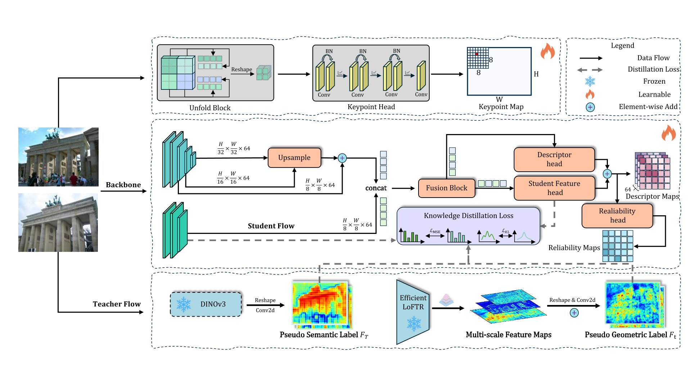

<h2> Dual Distillation for Semantic and Geometric Local Feature Learning </h2>

  Yiyuan Wang1,2,
  Xinze Li1,
  Puzhen Wu3,
  Junkai Zhang4,
  Weifeng Su1,5,
  Wentao Cheng1,†

  1Department of Computer Science and Technology, Hong Kong Baptist University, Hong Kong, China  
  2Department of Computer Science and Technology, Beijing Normal-Hong Kong Baptist University, Zhuhai, China  
  3Department of Orthopaedics and Traumatology, The University of Hong Kong, Hong Kong, China  
  4School of Law, Tsinghua University, Beijing, China  
  5Guangdong Provincial Key Laboratory of Interdisciplinary Research and Application for Data Science

  † Corresponding Author

<!-- ==================== 机构 Logo 三行布局 ==================== -->

   &nbsp;&nbsp;&nbsp;&nbsp;
  

   &nbsp;&nbsp;&nbsp;&nbsp;
  
  

<!-- ==================================================== -->

## 🔭 Overview

Dual Distillation proposes a novel dual distillation framework that simultaneously enhances semantic and geometric local feature learning through teacher-student distillation, achieving superior performance on various downstream tasks including relative pose estimation, homography estimation, and visual localization demonstrate.

  

